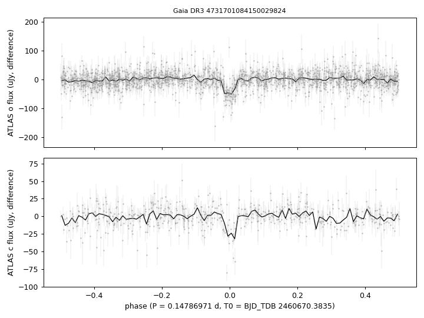
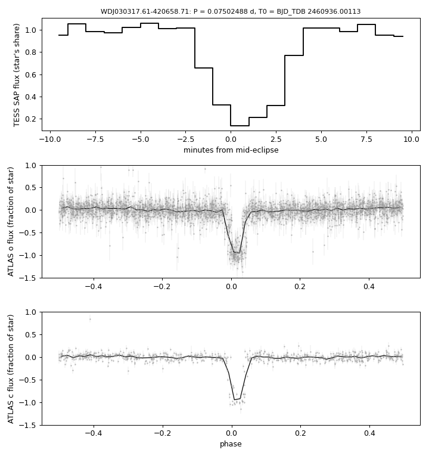

# Eclipse and Balmer emission

## Eclipse
`tables/eclipsing_4731701084150029824.csv`: eclipse ephemeris of Gaia DR3 4731701084150029824 from ATLAS forced photometry (method in [METHODS.md](../METHODS.md#methods)). The star has the colours and luminosity of a mid-M dwarf (BP-RP 2.82, parallax 9.10 mas, M_G 13.2), not of a white dwarf; the eclipses remove about a third of its light for 10.6 min every 3.55 h, consistent with a compact companion being totally eclipsed, but the eclipsed object is not identified.

## Eclipse of WDJ030317.61-420658.71
`tables/eclipsing_4851800979770492544.csv` and `..._profile.csv`: eclipse ephemeris of Gaia DR3 4851800979770492544 (DA white dwarf, G = 17.95, 322 pc) from 690 eclipses timed in three TESS 2-min sectors (97, 105, 106), checked against ATLAS forced photometry over 2016-2026 (method in [METHODS.md](../METHODS.md#methods)). P = 0.07502488 ± 0.00000002 d (108.036 min), T0 = BJD_TDB 2460936.00113; the 1-min TESS profile reaches 0.14 of the star's flux with 4 min below half flux; the ATLAS fluxes within 2 min of the predicted mid-eclipse average −0.72 ± 0.04 (o) and −0.59 ± 0.08 (c) of the star's flux, i.e. the eclipse is total or nearly so in 30-s exposures. Out of eclipse the ATLAS o band carries a 6% sinusoidal modulation at the orbital period.

## Balmer emission
`tables/balmer_emission.csv`: H-alpha and H-beta emission equivalent widths and double-peak separations of two SDSS-V spectra.

