# Short-period white dwarfs with irradiated companions

`tables/irradiated_companions.csv` lists eleven white dwarfs with photometric periods of 64-426 min. In each, the amplitude is larger in red than in blue light. For nine of them the WISE photometry (and VISTA photometry, where available) exceeds the white-dwarf prediction; WDJ194901.41+673005.59 has no infrared measurement, and WDJ001049.73−402029.49 has no CatWISE source within 2″ (its VHS J band is 1.8 times the prediction).

`tables/irradiated_companions_periods.csv` gives the highest periodogram peak and the semi-amplitude at the adopted period for each data set. `tables/desi_halpha_6914922055508553984.csv` gives the H-alpha emission fit of WDJ205249.27−032419.53. The method is in [METHODS.md](../METHODS.md#methods).

| star | Gaia DR3 | G | distance (pc) | GF21 Teff, mass (H) | P (min) | semi-amplitude | W1, W2 / white-dwarf model | companion M_W1 |
|---|---|---|---|---|---|---|---|---|
| WDJ205249.27−032419.53 | 6914922055508553984 | 17.47 | 334 | 16.2 kK, 0.30 Msun | 97.703 | ZTF g 2.9%, r 7.0%; TESS 10.1-10.7% | 3.7, 4.4 | 9.25 |
| WDJ212738.67+593755.72 | 2191618770599895296 | 16.87 | 241 | 13.8 kK, 0.26 Msun | 130.182 | ZTF g 1.5%, r 4.2%; TESS 6.1-8.7% | 3.6, 3.5 | 9.28 |
| WDJ070106.16−534811.37 | 5503429908930455808 | 18.43 | 602 | 16.2 kK, 0.26 Msun | 81.494 | Gaia G 9.9%, BP 6.1 ± 2.7%, RP 16 ± 5% | 2.2, 2.1 | 9.82 |
| WDJ040444.35−395043.1 | 4844023064578952320 | 17.66 | 632 | 20.6 kK, 0.24 Msun | 117.319 | Gaia G 9.8%, BP 3.9 ± 1.9%, RP 22 ± 3% | 2.0, 1.3 | 9.33 |
| WDJ194901.41+673005.59 | 2249098833310553728 | 18.03 | 739 | 16.8 kK, 0.14 Msun | 63.680 | Gaia G 15.6%, BP 16 ± 3%, RP 27 ± 3%; TESS 27-51% | – | – |
| WDJ005615.18−661731.98 | 4705562733524591232 | 18.80 | 714 | 15.4 kK, 0.25 Msun | 73.521 | Gaia G 8.3%, BP 5.6 ± 2.7%, RP 22 ± 5% | 1.7, 1.8 | 10.39 |
| WDJ001049.73−402029.49 | 4996506979251027584 | 18.33 | 745 | 18.8 kK, 0.25 Msun | 112.225 | ATLAS c 7.8%, o 12.4%; TESS 16.1-23.4% | – (J 1.8x) | – |
| WDJ013915.33+312419.24 | 303768056000635776 | 18.02 | 925 | 21.4 kK, 0.21 Msun | 213.157 | ZTF g 4.8%; TESS 20.7% | 2.1, 2.1 | 8.78 |
| WDJ103039.63−275438.60 | 5467851842959399808 | 18.31 | 761 | 13.1 kK, 0.12 Msun | 240.492 | ZTF g 4.0%, r 10.0%; TESS 14.1% | 6.4, 8.1 | 7.39 |
| WDJ140056.81−264218.70 | 6177529630243170432 | 18.30 | 898 | 36.0 kK, 0.41 Msun | 130.045 | ZTF g 5.4%, r 11.2%; TESS 27.4% | 2.8, 4.6 | 8.97 |
| WDJ011651.58−044046.82 | 2482810406432480512 | 18.34 | 978 | 21.7 kK, 0.23 Msun | 426.153 | ZTF g 3.0%, r 7.4%; TESS 9.0-10.1% | 3.5, 3.9 | 8.13 |

- **Temperatures and masses:** Gentile Fusillo et al. (2021) H-atmosphere fits to Gaia photometry.
- **Distance:** 1/parallax.
- **Infrared ratios:** observed flux divided by the pure-H model flux at that Teff and log g, scaled to Gaia G.
- **Companion M_W1:** the W1 excess converted to an absolute magnitude.
- **Limits of the photometry:**
  - W1 of WDJ070106.16−534811.37 is 18.07; its W2 and the W2 of WDJ040444.35−395043.1 have errors of 0.28-0.31 mag, close to the CatWISE limit.
  - W1 of WDJ005615.18−661731.98 is 18.69 ± 0.17 and its W2 (18.64) has no error in CatWISE2020; both are at the survey limit. Its VHS J magnitude (18.75 ± 0.11) is 1.44 times the white-dwarf prediction.
  - TESS full-frame-image amplitudes are fractions of the total aperture flux, not corrected for other stars; only their periods are used.

## WDJ205249.27−032419.53 (Gaia DR3 6914922055508553984)
- **Period:** P = 97.703 min in ZTF, Gaia DR3 and TESS (sectors 55 and 81, 120 s). The nearest alias has Δχ² = 4965.
- **Existing classifications:**
  - VSX and Chen et al. (2020) list type DSCT with P = 0.0678498 d.
  - Wang et al. (2025) list P = 0.06785 d (TESS).
  - DESI DR1: DAe (Amorim et al. 2026) and WD+MS (Swan et al. 2026).
  - Kilic et al. (2026): DA, 18.4 kK, log g 7.26.
- **DESI DR1 spectrum** (one 494-s exposure, tile 20836, petal 8, MJD 59358.46):
  - Balmer absorption and a narrow H-alpha emission line at +189 ± 8 km/s (σ = 1.9 Å), at photometric phase 0.81 (phase 0 = maximum light).
  - The median residual of 28 galaxy and QSO spectra on the same tile and petal peaks at 6561.6 Å (+18%). This is the flux-calibration feature described by Swan et al. (2026).
  - A fit with that residual as a free multiplicative term needs the emission line: Δχ² = 211 for three parameters.

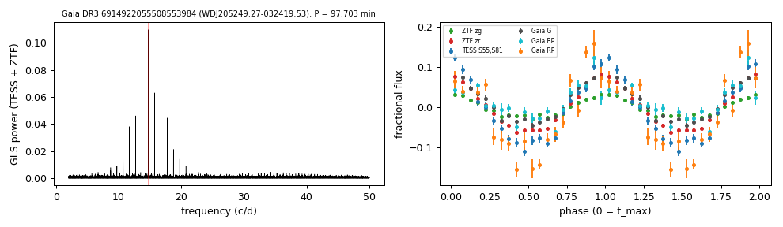

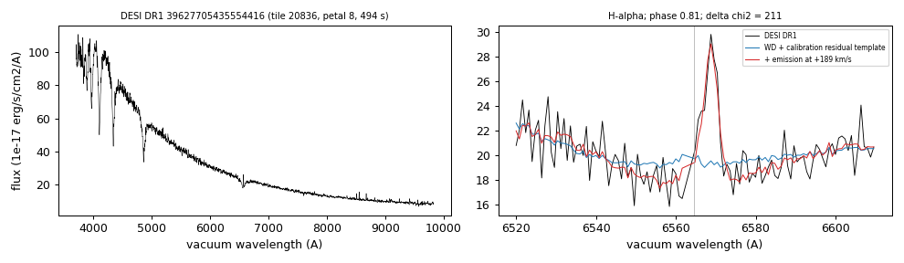

## WDJ212738.67+593755.72 (Gaia DR3 2191618770599895296)
- **Period:** P = 130.182 min in ZTF, Gaia DR3 and TESS (sectors 76, 77, 83 and 84, 120 s). The nearest alias has Δχ² = 4186.
- **Existing classifications:**
  - VSX and Chen et al. (2020) list type DSCT with P = 0.0904050 d.
  - Jestin et al. (2026) list it as periodic; the period is also in Ranaivomanana et al. (2025).
- **Spectra:** none found in SDSS, DESI DR1, SDSS-V DR20 or LAMOST DR11.

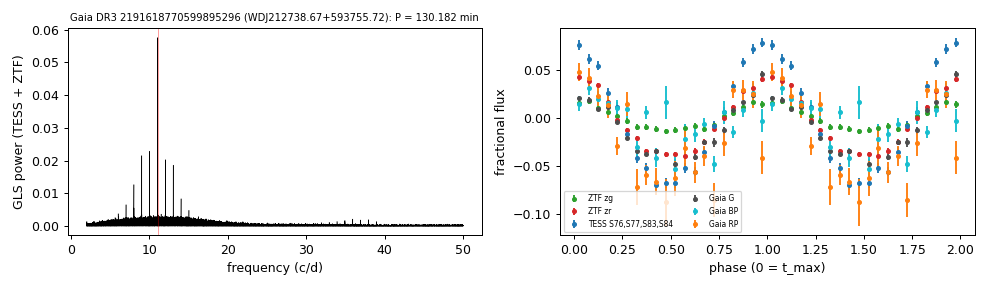

## WDJ070106.16−534811.37 (Gaia DR3 5503429908930455808)
- **Period:** P = 81.494 min in Gaia DR3 and TESS full-frame images (sectors 88, 89, 93, 96 and 98). The nearest alias has Δχ² = 563.
- **Existing classifications:**
  - VSX lists Gaia DR3 type VAR with P = 0.0565929 d.
  - The period is also in Ranaivomanana et al. (2025).
  - Gaia XP class DB (Vincent et al. 2024).
- **Spectra:** none found.

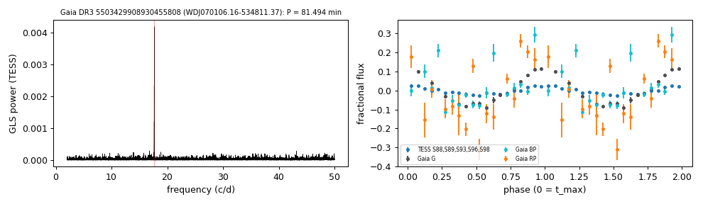

## WDJ040444.35−395043.1 (Gaia DR3 4844023064578952320)
- **Period:** P = 117.319 min in Gaia DR3 and TESS full-frame images (sectors 106 and 107). The nearest alias has Δχ² = 1359.
- **Existing classifications:** VSX lists type WD with the Gaia period (0.0814713 d); the period is also in Ranaivomanana et al. (2025).
- **Spectrum:** SDSS-V DR20 has one visit (S/N 14), classified DA by SnowWhite (sdss_id 93071386); Kosakowski et al. (2023) fit a spectrum with T_eff = 35,120 K, log g = 7.54.

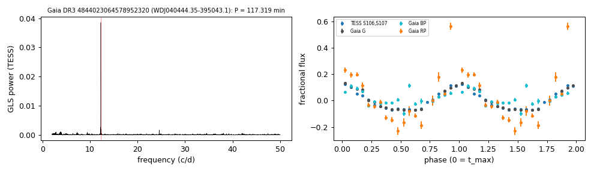

## WDJ194901.41+673005.59 (Gaia DR3 2249098833310553728)
- **Period:** P = 63.680 min in Gaia DR3 (2014-2017) and TESS (sectors 56, 58-60, 73-78 and 81-83, 120 s, 2022-2024), folded on one ephemeris. The nearest alias has Δχ² = 8903.
- **TESS amplitudes:** 27-51% per sector (114% in sector 76) after the SPOC crowding correction; they depend on that correction.
- **Existing classifications:** VSX lists Gaia DR3 type VAR with P = 0.0442223 d; the period is also in Ranaivomanana et al. (2025) and Wang et al. (2025, TESS, P = 0.04422 d).
- **Infrared:** the CatWISE, unWISE and AllWISE source 3.4-3.7″ away coincides with a red Pan-STARRS source 3.7″ from the white dwarf (i = 20.4, not in Gaia DR3). There is no infrared measurement of the white dwarf.
- **Spectra:** none found in SDSS, DESI DR1, SDSS-V DR20 or LAMOST DR11.

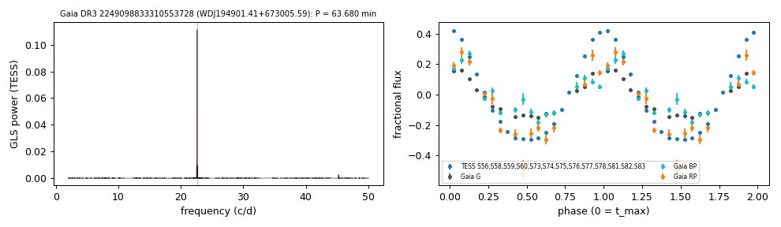

## WDJ005615.18−661731.98 (Gaia DR3 4705562733524591232)
- **Period:** P = 73.521 min in Gaia DR3 and TESS full-frame images (sectors 1, 2, 28, 29, 68, 69, 95, 96, 103 and 104). The nearest alias has Δχ² = 539.
- **TESS:** the highest peak of a single sector lies within 0.015 c/d of the adopted frequency in sectors 29, 68, 69, 95 and 96 (false-alarm probabilities 0.024 to 3 × 10⁻⁵). The star (G = 18.80) contributes a small fraction of the aperture flux.
- **Existing classifications:** VSX lists Gaia DR3 type VAR with P = 0.0510565 d; the period is also in Ranaivomanana et al. (2025).
- **Spectra:** a 6dFGS spectrum (2005) has a continuum S/N of about 5. The star is not in the SDSS-V DR20 white-dwarf catalogue (SnowWhite).

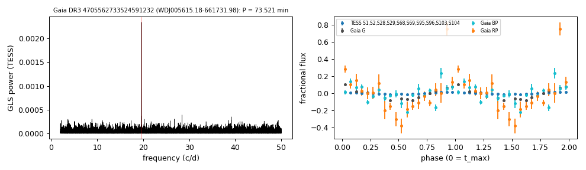

## WDJ001049.73−402029.49 (Gaia DR3 4996506979251027584)
- **Period:** P = 112.225 min in ATLAS (c and o, 2015-2026) and TESS (sectors 103 and 105, 120 s). The nearest alias has Δχ² = 2840.
- **Amplitudes:** ATLAS c 7.8%, o 12.4%; TESS 16.1% and 23.4% (PDCSAP, CROWDSAP 0.45).
- **Existing classifications:** Stringer et al. (2019, DES) list an RR Lyrae candidate period of 0.486748 d at this position; VSX none; Gavras et al. (2023) constant.
- **Infrared:** no CatWISE source within 2″ (AllWISE W1 17.67 at 1.4″); VHS J is 1.83 times the white-dwarf model.
- **Spectra:** none found.

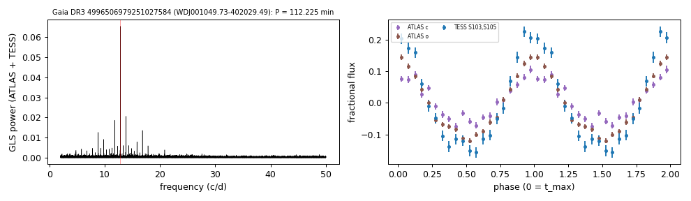

## WDJ013915.33+312419.24 (Gaia DR3 303768056000635776)
- **Period:** P = 213.157 min in ZTF g (71 points) and TESS (sector 85, 120 s). The nearest alias has Δχ² = 57.
- **Amplitudes:** ZTF g 4.8%, ZTF i 21.4% (51 points; not in the tables); TESS 20.7% (PDCSAP, CROWDSAP 0.26).
- **Existing classifications:** the Ritter & Kolb catalogue, Abrahams et al. (2020) and Gavras et al. (2023) attach the dwarf nova TU Tri (P = 0.0724 d) to this Gaia source. The VSX and Downes et al. (2001) positions of TU Tri fall 6.9″ away on Gaia DR3 303768060296004864 (G = 20.57), whose ZTF light curve shows outbursts (g 20.6 to 15.4); the white dwarf's ZTF light curve shows none (2018-2023).
- **Infrared:** W1 and W2 are 2.1 times the white-dwarf model.
- **Spectra:** none found.

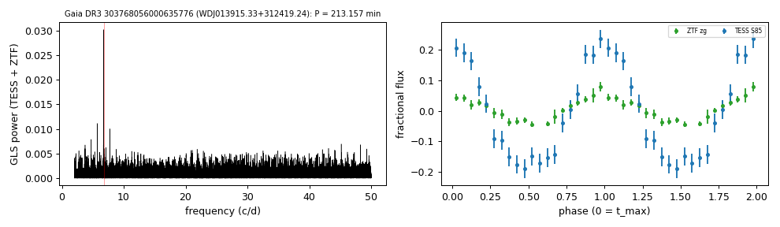

## WDJ103039.63−275438.60 (Gaia DR3 5467851842959399808)
- **Period:** P = 240.492 min in ZTF r and TESS (sector 99, 120 s); the ZTF g and r peaks at 6.990 and 4.985 c/d are the +1 and −1 c/d aliases. The nearest alias has Δχ² = 235.
- **Amplitudes:** ZTF g 4.0%, r 10.0%; TESS 14.1% (PDCSAP, CROWDSAP 0.016; a G = 14.3 star 22″ away dominates the aperture).
- **Existing classifications:** Pelisoli & Vos (2019) Gaia DR2 ELM candidate; Kosakowski et al. (2023, ELM Survey South II) mark it as periodically variable in ZTF DR16 and TESS without giving a period; Madurga Favieres et al. (2024) list the W1 excess (photometric, no spectral type); Gavras et al. (2023) constant; VSX none.
- **Infrared:** W1 6.4 and W2 8.1 times the white-dwarf model; VHS J 2.0 and Ks 3.1 times. The white-dwarf model uses the Gentile Fusillo et al. (2021) photometric parameters; the spectroscopic fit below is hotter.
- **Spectra:** Kosakowski et al. (2023): one optical spectrum, pure-hydrogen fit T_eff = 32,020 ± 800 K, log g = 7.75 ± 0.16 (public Zenodo archive).

## WDJ140056.81−264218.70 (Gaia DR3 6177529630243170432)
- **Period:** P = 130.045 min in ZTF g, r and TESS (sector 102, 120 s). The nearest alias has Δχ² = 437.
- **Amplitudes:** ZTF g 5.4%, r 11.2%; TESS 27.4% (PDCSAP, CROWDSAP 0.11).
- **Existing classifications:** Gavras et al. (2023) constant; VSX none; not in the MWDD.
- **Infrared:** W1 2.8 and W2 4.6 times the white-dwarf model; VHS J 1.6 times.
- **Spectra:** none found.

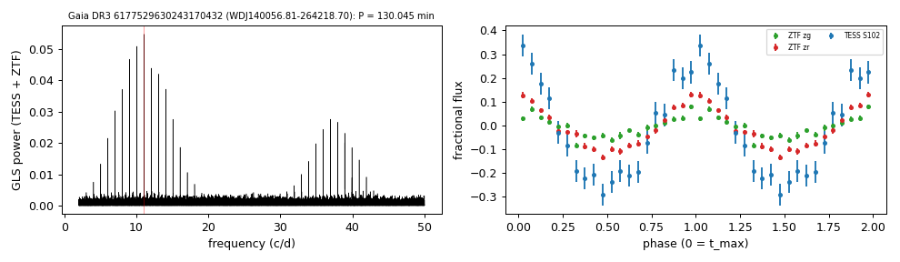

## WDJ011651.58−044046.82 (Gaia DR3 2482810406432480512)
- **Period:** P = 426.153 min in ZTF g, r and TESS (sectors 70 and 97, 120 s). The nearest alias has Δχ² = 869.
- **Amplitudes:** ZTF g 3.0%, r 7.4%; TESS 9.0-10.1% (PDCSAP, CROWDSAP 0.72).
- **Existing classifications:** Stringer et al. (2019, DES) list an RR Lyrae candidate period of 0.640697 d; Kosakowski et al. (2023, ELM Survey South II) mark it as periodically variable in ZTF DR16 without giving a period; Gavras et al. (2023) constant; Wang et al. (2025) no period; VSX none.
- **Infrared:** W1 3.5 and W2 3.9 times the white-dwarf model; VHS J 1.5 and Ks 1.9 times. The white-dwarf model uses the Gentile Fusillo et al. (2021) photometric parameters; the spectroscopic fit below is hotter.
- **Spectra:** Kosakowski et al. (2023): one optical spectrum, pure-hydrogen fit T_eff = 45,500 ± 870 K, log g = 7.58 ± 0.10 (public Zenodo archive); Kepler et al. (2019): DA, 39,572 K, 0.47 Msun from the SDSS spectrum; Kilic et al. (2026): 38,673 K from the DESI spectrum.

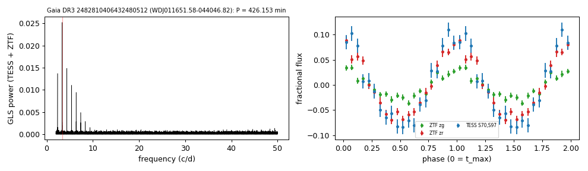
