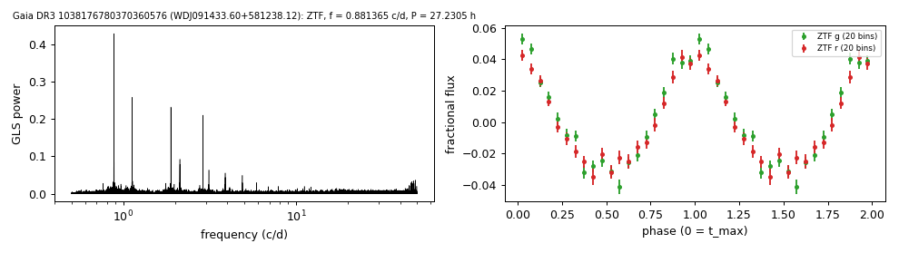

# WDJ091433.60+581238.12 (Gaia DR3 1038176780370360576)

## Day-scale periods of hot white dwarfs

SBSS 0910+584; spectral type DO (MWDD). G = 17.73, 810 pc. Chen et al. (2020) list it as a suspected ZTF variable with P = 1.1348 d, the same period.

**Measurement.** P = 27.23048 ± 0.00056 h (ZTF, n = 2119, BJD 2458202.763-2460968.97); semi-amplitude 3.8% ± 0.1%.

| data set | n | semi-amplitude | first harmonic |
|---|---|---|---|
| ZTF | 2119 | 3.75% ± 0.09% | 0.63% |
| ZTF zg | 860 | 4.00% ± 0.14% | 0.57% |
| ZTF zr | 1259 | 3.44% ± 0.13% | 0.72% |

Method and context: [hot_wd_periods](../hot_wd_periods.md)

Tables: [hot_wd_periods.csv](../../tables/hot_wd_periods.csv). Scripts: `scripts/hot_dae_wd_periods.py` (commands in the [reproduction list](../../README.md#reproduction)).

## Input data

- [data/ztf_1038176780370360576.csv](../../data/ztf_1038176780370360576.csv)

## Figures

