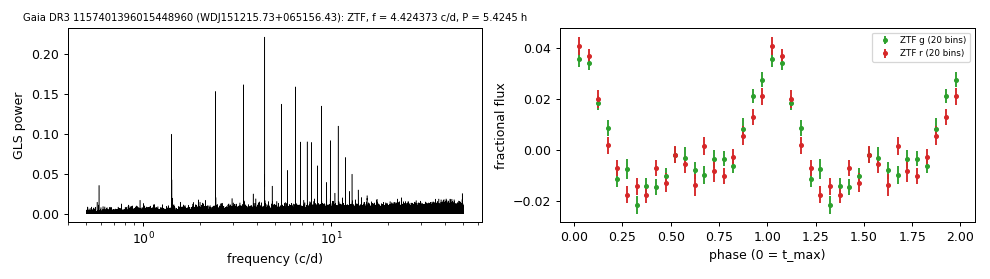

# WDJ151215.73+065156.43 (Gaia DR3 1157401396015448960)

## Day-scale periods of hot white dwarfs

GALEX J151215.7+065156; UHE white dwarf, DOZ (Reindl et al. 2021, where the period is published). G = 17.22, 990 pc.

**Measurement.** P = 5.4245 ± 2e-05 h (ZTF, n = 1334, BJD 2458198.9-2460910.666); semi-amplitude 1.8% ± 0.1%.

| data set | n | semi-amplitude | first harmonic |
|---|---|---|---|
| ZTF | 1334 | 1.83% ± 0.09% | 1.40% |
| ZTF zg | 520 | 1.91% ± 0.12% | 1.36% |
| ZTF zr | 814 | 1.75% ± 0.13% | 1.45% |

Method and context: [hot_wd_periods](../hot_wd_periods.md)

Tables: [hot_wd_periods.csv](../../tables/hot_wd_periods.csv). Scripts: `scripts/hot_dae_wd_periods.py` (commands in the [reproduction list](../../README.md#reproduction)).

## Input data

- [data/ztf_1157401396015448960.csv](../../data/ztf_1157401396015448960.csv)

## Figures

