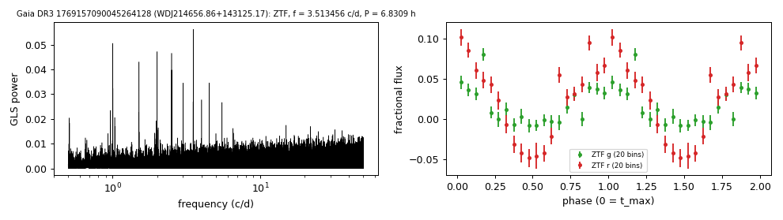

# WDJ214656.86+143125.17 (Gaia DR3 1769157090045264128)

## Periods of DA white dwarfs with emission lines

DESI DR1 class DAE; GF21 16.0 kK, 0.24 Msun; W1, W2 excess 1.9, 1.6 mag. G = 19.45, 1010 pc. Spectroscopic fit 40,446 K, log g 7.85 (Kilic et al. 2026). Swan et al. (2026) list the same ZTF period (0.2846190 d).

**Measurement.** P = 6.83088 ± 4e-05 h (ZTF, n = 2295, BJD 2458246.952-2460969.771); semi-amplitude 3.9% ± 0.3%.

| data set | n | semi-amplitude | first harmonic |
|---|---|---|---|
| ZTF | 2295 | 3.88% ± 0.33% | 0.86% |
| ZTF zg | 1057 | 2.57% ± 0.44% | 0.62% |
| ZTF zr | 1238 | 6.44% ± 0.49% | 1.34% |

Method and context: [dae_wd_periods](../dae_wd_periods.md)

Tables: [dae_wd_periods.csv](../../tables/dae_wd_periods.csv). Scripts: `scripts/hot_dae_wd_periods.py` (commands in the [reproduction list](../../README.md#reproduction)).

## Input data

- [data/ztf_1769157090045264128.csv](../../data/ztf_1769157090045264128.csv)

## Figures

