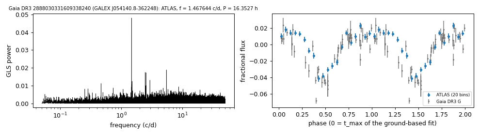

# GALEX J054140.8-362248 (Gaia DR3 2888030331609338240)

## Photometric periods

White dwarf selected by its Gaia DR3 GLS frequency (GALEX J054140.8-362248).

**Measurement.** P = 16.35274 ± 0.00013 h (ATLAS, n = 5225, BJD 2457322.039-2461302.87); semi-amplitude 2.4% ± 0.1%.

| data set | n | semi-amplitude | first harmonic |
|---|---|---|---|
| ATLAS | 5225 | 2.41% ± 0.15% | 1.07% |
| Gaia DR3 epoch photometry G | 46 | 2.88% ± 0.28% | - |
| TESS S98 PDCSAP (TIC 705508671, CROWDSAP 0.202) | 28783 | 3.78% ± 0.49% | - |

Method and context: [periodic](../periodic.md)

Tables: [periodic_white_dwarfs.csv](../../tables/periodic_white_dwarfs.csv). Scripts: `scripts/periodic_white_dwarfs.py` (commands in the [reproduction list](../../README.md#reproduction)).

## Input data

- [data/atlas_forced_photometry_2888030331609338240.txt](../../data/atlas_forced_photometry_2888030331609338240.txt)
- [data/gaia_dr3_epoch_photometry_2888030331609338240.csv](../../data/gaia_dr3_epoch_photometry_2888030331609338240.csv)

## Figures

