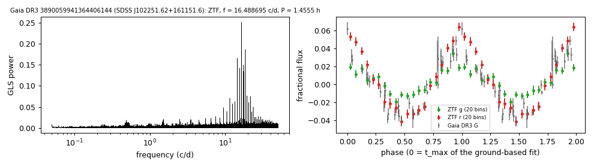

# SDSS J102251.62+161151.6 (Gaia DR3 3890059941364406144)

## Photometric periods

DA with narrow Balmer lines; Gentile Fusillo et al. (2021) H-atmosphere fit 22,100 K, 0.32 Msun; Kepler et al. (2019) fit the SDSS spectrum with 29,277 K, 0.43 Msun.

**Measurement.** P = 1.45554 ± 0.0 h (ZTF, n = 1840, BJD 2458202.772-2460970.032); semi-amplitude 2.9% ± 0.1%.

| data set | n | semi-amplitude | first harmonic |
|---|---|---|---|
| ZTF | 1840 | 2.92% ± 0.12% | 0.37% |
| ZTF zg | 706 | 1.79% ± 0.14% | 0.16% |
| ZTF zr | 1134 | 4.64% ± 0.18% | 0.57% |
| Gaia DR3 epoch photometry G | 38 | 3.82% ± 0.20% | - |

Method and context: [periodic](../periodic.md)

Tables: [periodic_white_dwarfs.csv](../../tables/periodic_white_dwarfs.csv). Scripts: `scripts/periodic_white_dwarfs.py` (commands in the [reproduction list](../../README.md#reproduction)).

## Input data

- [data/gaia_dr3_epoch_photometry_3890059941364406144.csv](../../data/gaia_dr3_epoch_photometry_3890059941364406144.csv)
- [data/ztf_3890059941364406144.csv](../../data/ztf_3890059941364406144.csv)

## Figures

