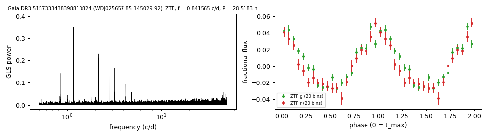

# WDJ025657.85-145029.92 (Gaia DR3 5157333438398813824)

## Day-scale periods of hot white dwarfs

Spectral type DA with a photometric temperature above 100 kK (MWDD). G = 17.37, 1072 pc.

**Measurement.** P = 28.51831 ± 0.00064 h (ZTF, n = 823, BJD 2458329.963-2460968.862); semi-amplitude 3.4% ± 0.1%.

| data set | n | semi-amplitude | first harmonic |
|---|---|---|---|
| ZTF | 823 | 3.44% ± 0.14% | 0.42% |
| ZTF zg | 421 | 3.39% ± 0.19% | 0.23% |
| ZTF zr | 402 | 3.48% ± 0.23% | 0.86% |

Method and context: [hot_wd_periods](../hot_wd_periods.md)

Tables: [hot_wd_periods.csv](../../tables/hot_wd_periods.csv). Scripts: `scripts/hot_dae_wd_periods.py` (commands in the [reproduction list](../../README.md#reproduction)).

## Input data

- [data/ztf_5157333438398813824.csv](../../data/ztf_5157333438398813824.csv)

## Figures

