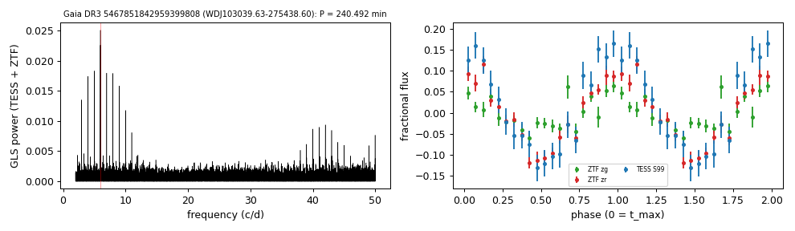

# WDJ103039.63-275438.60 (Gaia DR3 5467851842959399808)

## Short-period white dwarfs with irradiated companions

Low-mass white dwarf: GF21 H-atmosphere Teff 13101 K, 0.119 Msun; G = 18.315, 761 pc. Spectroscopic fit 32,020 K, log g 7.75 (Kosakowski et al. 2023).

**Measurement.** P = 240.492 min; red-to-blue (Gaia RP/BP) semi-amplitude ratio 2.45; W1 6.38x the white-dwarf model (companion M_W1 = 7.39).

Method and context: [irradiated_companions](../irradiated_companions.md)

Tables: [irradiated_companions.csv](../../tables/irradiated_companions.csv), [irradiated_companions_periods.csv](../../tables/irradiated_companions_periods.csv). Scripts: `scripts/irradiated_companions.py` (commands in the [reproduction list](../../README.md#reproduction)).

## Input data

- [data/ztf_5467851842959399808.csv](../../data/ztf_5467851842959399808.csv)

## Figures

