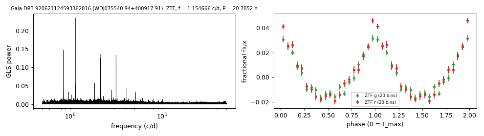

# WDJ075540.94+400917.91 (Gaia DR3 920621124593362816)

## Day-scale periods of hot white dwarfs

KUV 07523+4017; DOZ / PG 1159 (Reindl et al. 2021, where the period is published). G = 17.80, 1052 pc.

**Measurement.** P = 20.78523 ± 0.00033 h (ZTF, n = 4135, BJD 2458204.709-2460968.989); semi-amplitude 2.5% ± 0.1%.

| data set | n | semi-amplitude | first harmonic |
|---|---|---|---|
| ZTF | 4135 | 2.45% ± 0.07% | 0.64% |
| ZTF zg | 1428 | 2.23% ± 0.09% | 0.57% |
| ZTF zr | 2707 | 2.70% ± 0.11% | 0.70% |

Method and context: [hot_wd_periods](../hot_wd_periods.md)

Tables: [hot_wd_periods.csv](../../tables/hot_wd_periods.csv). Scripts: `scripts/hot_dae_wd_periods.py` (commands in the [reproduction list](../../README.md#reproduction)).

## Input data

- [data/ztf_920621124593362816.csv](../../data/ztf_920621124593362816.csv)

## Figures

