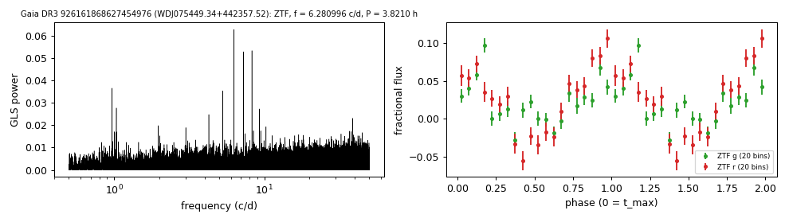

# WDJ075449.34+442357.52 (Gaia DR3 926161868627454976)

## Periods of DA white dwarfs with emission lines

DESI DR1 class DAe; GF21 18.9 kK, 0.21 Msun; W1, W2 excess 2.2, 2.9 mag. G = 19.40, 1449 pc. Spectroscopic fit 32,019 K, log g 7.22 (Kilic et al. 2026).

**Measurement.** P = 3.82105 ± 1e-05 h (ZTF, n = 2034, BJD 2458204.71-2460948.996); semi-amplitude 3.9% ± 0.3%.

| data set | n | semi-amplitude | first harmonic |
|---|---|---|---|
| ZTF | 2034 | 3.86% ± 0.33% | 0.19% |
| ZTF zg | 892 | 2.80% ± 0.49% | 0.57% |
| ZTF zr | 1142 | 5.70% ± 0.45% | 0.51% |

Method and context: [dae_wd_periods](../dae_wd_periods.md)

Tables: [dae_wd_periods.csv](../../tables/dae_wd_periods.csv). Scripts: `scripts/hot_dae_wd_periods.py` (commands in the [reproduction list](../../README.md#reproduction)).

## Input data

- [data/ztf_926161868627454976.csv](../../data/ztf_926161868627454976.csv)

## Figures

