# Photometric periods

## Gaia DR3 6021870154194477312

`tables/periodic_6021870154194477312.csv` gives the frequency, amplitudes and times of maximum from ATLAS, Gaia DR3 epoch photometry and TESS, and fits for the three Gaia sources within 13″.

Gaia DR3 lists the same frequency (13.92979 c/d) in its spurious-signal table (Holl et al. 2023, A&A 674, A25). VSX lists the star as type WD without a period.

SDSS-V spectrum (all visits):

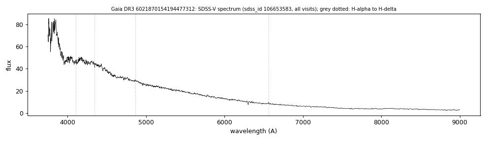

ATLAS periodogram, and ATLAS, Gaia and TESS light curves folded on the adopted frequency:

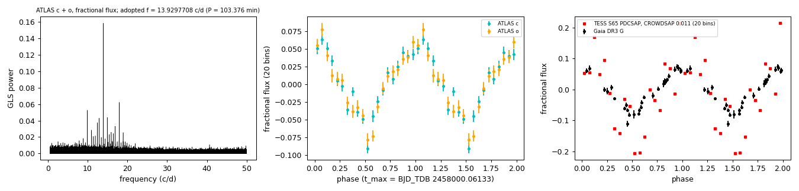

## Gaia DR3 3107374277060584064 (WDJ064438.09-004550.51)

G = 17.27, parallax 1.82 ± 0.09 mas, BP−RP = −0.35. Existing classifications: SIMBAD WD* (DO:), MWDD DO: (Gaia XP), SDSS-V SnowWhite DA: (sdss_id 74709777), VSX type WD without a period.

- **Period.** P = 0.59288582 d (14.2293 h, `tables/reflection_3107374277060584064.csv`). It is the highest peak (0.05-20 c/d) in:
  - three CoRoT light curves (2007, 2007-08 and 2012);
  - Gaia DR3 epoch photometry (2014-2017);
  - ZTF r (2018-2024); the ZTF g peak is the 1 c/d alias.
- **Adopted frequency.** From a joint fit of CoRoT and ZTF. The nearest cycle-count alias has Δχ² = 81,066 (χ² per point 62), and all data sets agree in phase within 0.02 cycles.
- **Amplitude.** The semi-amplitude is 11.6% in ZTF r, 3.9% in ZTF g and 10.2% in Gaia G.
- **CoRoT and the neighbour.** The CoRoT light curves belong to CoRoT 102743730, the G = 16.17 star Gaia DR3 3107374272762041856 4.1″ away, whose photometric mask includes this star. In ZTF that star shows no signal at this frequency (semi-amplitude 0.8% g, 0.4% r, within 1.2σ and 1.6σ of zero).
- **Eclipses.** None are seen in the CoRoT folds.
- **Earlier listing.** Ferreira Lopes et al. (2025) list CoRoT 102743730 with P = 0.592812 d (class BCEP/other).
- **SDSS-V spectrum** (four visits, 2021).
  - A blue continuum with He II 4686 Å absorption and weak Balmer absorption.
  - H-alpha, H-beta and Ca II triplet emission in three visits (`tables/reflection_3107374277060584064_visits.csv`). The emission velocities are +242, −166 and +152 km/s (H-alpha) and +202, −73 and +147 km/s (Ca II) at phases 0.67, 0.22 and 0.89 from maximum light.
  - No emission in the S/N 4 visit at phase 0.41.
  - Two visits (MJD 59273 and 59324) are not in the SDSS-V stack (`in_stack = False`).
    - Their He II 4686 absorption lies at +205 ± 22 and +176 ± 16 km/s relative to the in-stack coadd. The two in-stack visits give −1 ± 12 and +15 ± 25 km/s.
    - The velocity zero point of those visits is therefore offset, by an amount similar to their XCSAO velocities (+73 and +137 km/s). The emission velocities of MJD 59324 are uncertain by about that amount.
    - The in-stack visits (phases 0.67 and 0.89) are unaffected.

Folded light curves and emission-line velocities (phase 0 = maximum of the ZTF r fit):

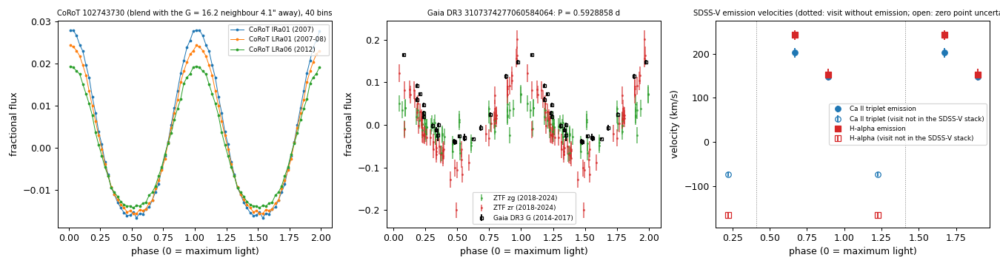

SDSS-V coadd and the line profiles of each visit:

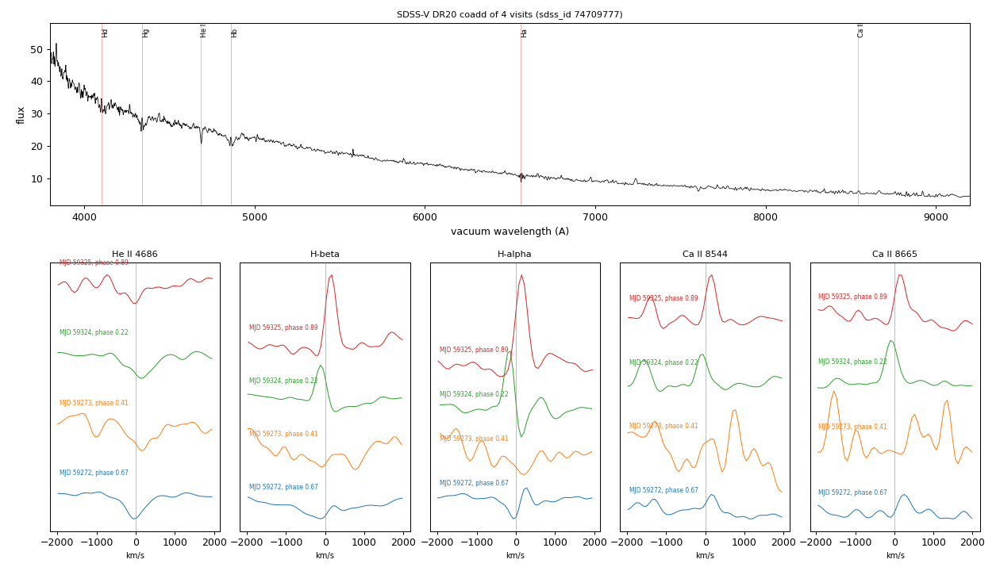

## Eighteen white dwarfs with ground-based periods

`tables/periodic_white_dwarfs.csv` covers eighteen white dwarfs. Fifteen were selected by their Gaia DR3 GLS frequency, and each of those frequencies was recovered in ATLAS or ZTF. These frequencies are listed in the Gaia DR3 spurious-signal table (Holl et al. 2023, A&A 674, A25). Two (WDJ183850.84-411333.59 and WDJ072758.87+101157.08) have periods found in TESS 2-min light curves and recovered in ATLAS or ZTF; they have no Gaia DR3 epoch photometry. WDJ080026.64+633414.85 has no Gaia DR3 epoch photometry; its period comes from ZTF. For each star the table gives the Gaia amplitude and time of maximum at that frequency, plus the TESS values where TESS data exist, and for ZTF the amplitudes per filter. Each figure shows the ground-based periodogram (left) and the ground-based and Gaia light curves folded on the adopted frequency (right).

**Gaia DR3 2883364038621038208** (GALEX J060343.7-380911): P = 10.80225 h

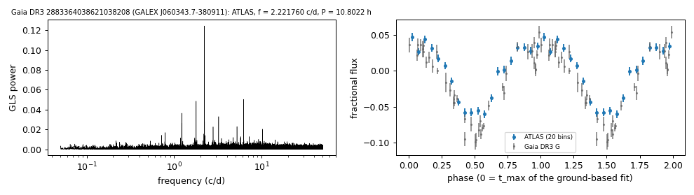

**Gaia DR3 178685757799822080** (GALEX J043613.3+383720): P = 175.15604 h

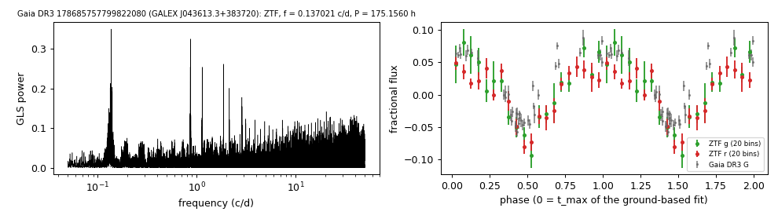

**Gaia DR3 6456720612064924928** (GALEX J211204.8-571801): P = 1.02224 h

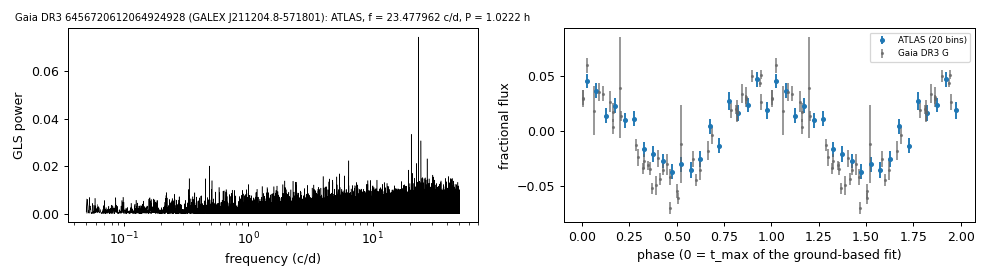

**Gaia DR3 2888030331609338240** (GALEX J054140.8-362248): P = 16.35274 h

**Gaia DR3 3496637913394359680** (GALEX J124819.8-261413): P = 141.25536 h

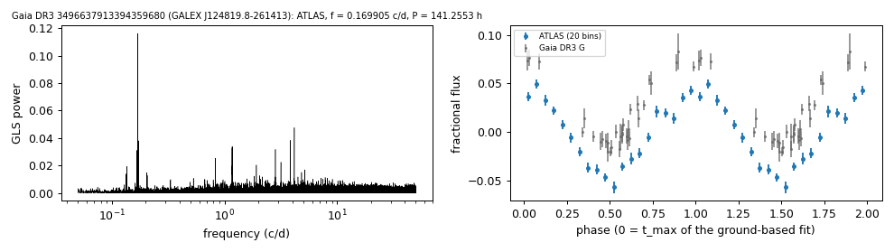

**Gaia DR3 437628614520520320** (WDJ025503.24+475833.96): P = 121.00599 h

- Chen et al. (2020, ApJS 249, 18) list it as a suspected ZTF variable with P = 5.04903 d, the same period.

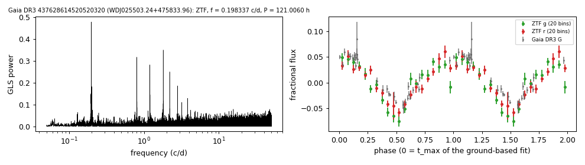

**Gaia DR3 6639666736903611136** (GALEX J191430.4-572023): P = 89.07682 h

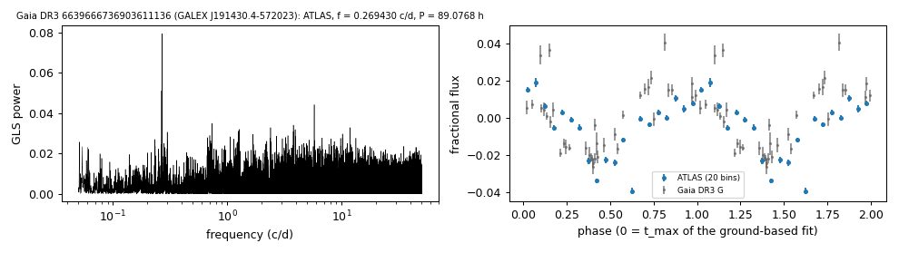

**Gaia DR3 3890059941364406144** (SDSS J102251.62+161151.6): P = 1.45554 h (87.33 min)

- Kepler et al. (2019) fit the SDSS spectrum with T_eff = 29,277 K and 0.43 Msun (DA).

- The semi-amplitude is 1.8% in ZTF g and 4.6% in ZTF r.
- TESS full-frame images (sectors 45, 46 and 72; `tables/tess_ffi_3890059941364406144.csv`): the same frequency is the highest peak between 5 and 30 c/d in each sector, with 5-6.5% of the expected flux of the star.
- The SDSS and BOSS spectra show a DA with narrow Balmer lines, with no emission lines. Gentile Fusillo et al. (2021) H-atmosphere fit: 22,100 K, 0.32 Msun.

**Gaia DR3 974895286283420160** (WDJ072009.19+464840.48): P = 19.14313 h. DA at 51 pc. The same frequency is the highest peak in TESS sectors 20, 47 and 60 (1.3%). Oliveira da Rosa et al. (2024) list a TESS period of 19.185 ± 0.014 h (TIC 407569944), and Wang et al. (2025) list 0.79774 d.

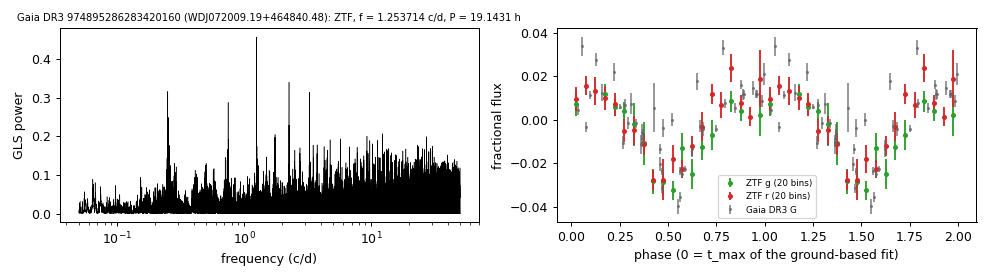

**Gaia DR3 2795150147707769728** (GALEX J003750.4+190136): P = 18.24064 h. DA; Gentile Fusillo et al. (2021) H-atmosphere fit: 27,000 K, 1.08 Msun. The semi-amplitude is 3.1% in ZTF g and 3.0% in ZTF r.

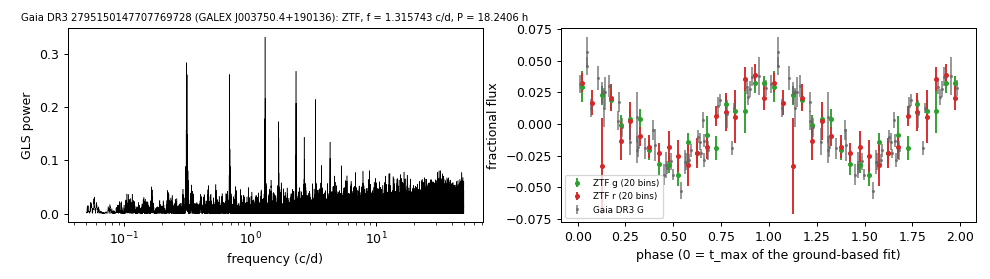

**Gaia DR3 6170660401283991680**: P = 27.00552 h. Gaia XP class DO (Vincent et al. 2024). ATLAS.

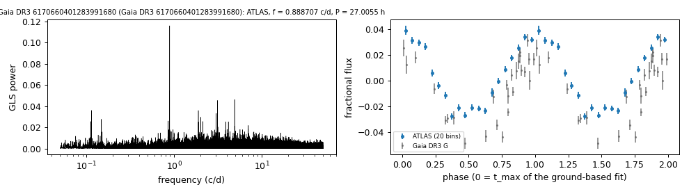

**Gaia DR3 6136817910121524096** (GALEX J132200.5-422412): P = 18.45593 h. Hot-subdwarf candidate in Geier et al. (2019). ATLAS; fractional amplitudes relative to the Gaia G flux.

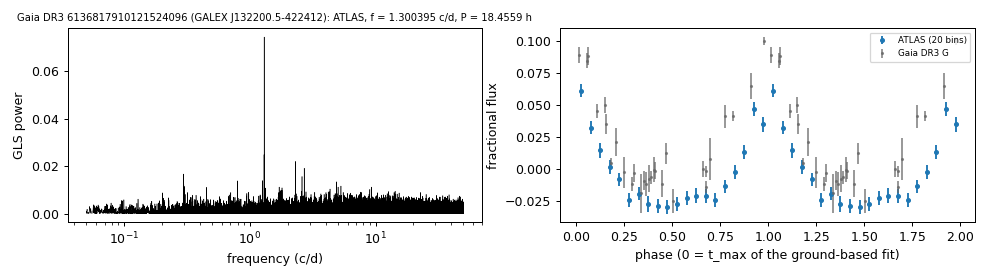

**Gaia DR3 3123625093275668736**: P = 10.39275 h. White dwarf and M dwarf in Rebassa-Mansergas et al. (2025); SDSS-V SnowWhite DA_MS (sdss_id 74949661). The semi-amplitude is 2.2% in ZTF g and 3.4% in ZTF r.

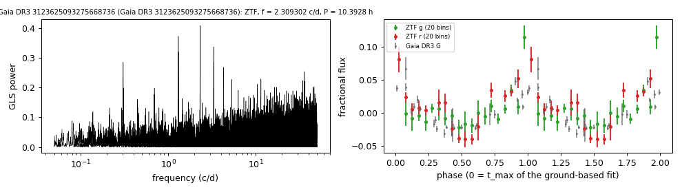

**Gaia DR3 3354819845628139904**: P = 12.58907 h. Hot-subdwarf candidate in Geier et al. (2019).
- Heinze et al. (2018, AJ 156, 241; ATLAS variable stars) list P = 1.04909 d, twice this period.

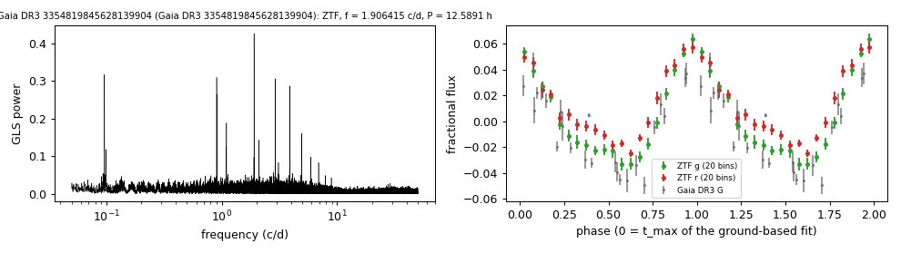

**Gaia DR3 3230486971974872192** (WDJ043832.74+003117.01): P = 26.09254 h.
- Steen et al. (2024, ApJ 967, 166) list the star as a likely binary with P = 26.0146 h from Gaia DR3 and 26.07 ± 0.12 h from ZTF, the same period.
- DO white dwarf: Teff 105.6 kK, log g 8.0 (Kilic et al. 2026a, via the Montreal White Dwarf Database).
- The semi-amplitude is 2.6% in ZTF g and 2.5% in ZTF r.
- TESS sector 98 (120 s): the same frequency is the highest peak between 0.2 and 50 c/d (semi-amplitude 3.7% after the SPOC crowding correction).
- The Gaia DR3 signal carries a scan-angle significance of 3.2 in the spurious-signal table (Holl et al. 2023). Jestin et al. (2026) list the star as not variable.

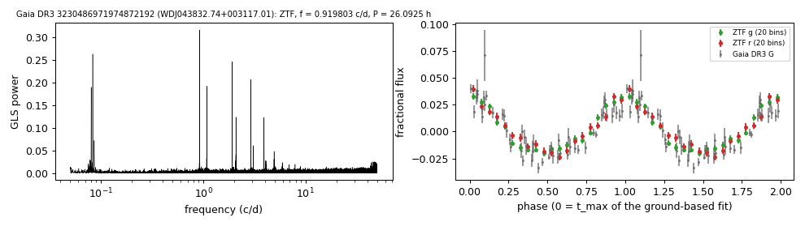

**Gaia DR3 1094376947131876352** (WDJ080026.64+633414.85): P = 21.41901 h, from ZTF (2018-2025).
- DESI DR1 class DOA, Teff 78.2 kK (Swan et al. 2026).
- The semi-amplitude is 2.4% in ZTF g and 1.6% in ZTF r.
- There is no Gaia DR3 epoch photometry. Jestin et al. (2026) list the star as not variable.

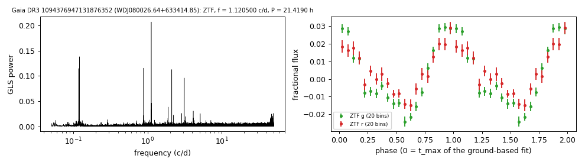

**Gaia DR3 6722639595190126208** (WDJ183850.84-411333.59): P = 0.64280 h (38.57 min); ATLAS semi-amplitude 4.0%, TESS PDCSAP 15.5-15.6% (CROWDSAP 0.055-0.084)

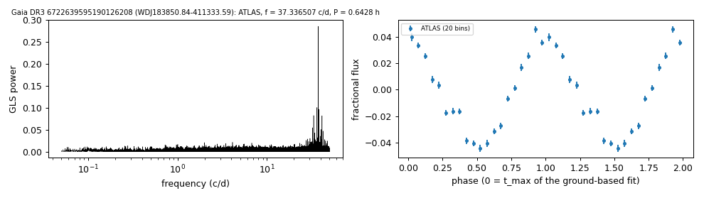

**Gaia DR3 3161618477052648192** (WDJ072758.87+101157.08): P = 0.48155 h (28.89 min); ZTF g 2.4%, r 2.6%; TESS PDCSAP 2.9-4.8%

Steen et al. (2024) list this white dwarf as a likely spotted variable with P = 0.4914 h from Gaia DR3 and ZTF photometry; that period is the one-cycle-per-day alias of the TESS, ZTF and ATLAS period given here.

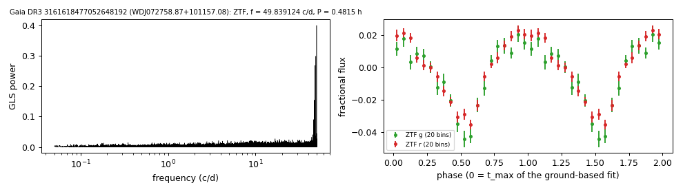
